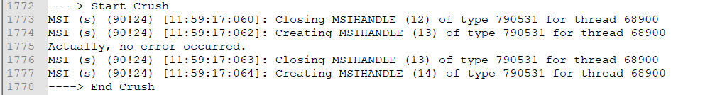

# Rollback Custom Action

## Description

Sometimes, when we install a product, the environment does not meet all the necessary criteria and some step from the installation process crushes. What happens with the changes made by the previous steps that already completed successfully? How can the installer undo those changes?

Fore each custom action that does a change in the system we must provide an additional custom action that reverts that change. We call this a rollback custom action.

## Step 1 - C# Implementation

Create the custom action and its corresponding rollback custom action in C#:

```csharp
[CustomAction]
public static ActionResult DoSomething(Session session)
{
    // do some changes here.

    return ActionResult.Success;
}

[CustomAction]
public static ActionResult DoSomethingRollback(Session session)
{
    // revert the changes here.

    return ActionResult.Success;
}
```

The two custom actions may seam to be just two regular custom actions at this level but we must take care of a few aspects:

- **Install custom action is deferred** -  The install custom action (`DoSomething` in our example) must be, later, included in the installer as deferred. The rollback mechanism does not work with immediate custom actions. Because of that, the custom action cannot access the properties of the installer and we must use a special mechanism to pass parameters from WiX and retrieve them in C#.
  - See the [Deferred Custom Action with Params](https://github.com/WiX-Toolset-Pills-15mg/Deferred-Custom-Action-with-Params) tutorial for more details.

- **Rollback custom action implements the opposite actions** - The rollback custom action (`DoSomethingRollback` in our example) must do the opposite of what the associated install custom action does.

## Step 2 - WiX declaration

Now let's declare the two custom actions in WiX:

```xml
<CustomAction
    Id="DoSomething"
    BinaryKey="CustomActionsBinary"
    DllEntry="DoSomething"
    Execute="deferred"
    Return="check" />

<CustomAction
    Id="DoSomethingRollback"
    BinaryKey="CustomActionsBinary"
    DllEntry="DoSomethingRollback"
    Execute="rollback"
    Return="check" />
```

At this level, we need to take care of two things:

- The normal custom action must have `Execute="deferred"` attribute.
  - As we said previously, the rollback mechanism does not work with immediate custom actions.
- The rollback custom action must have `Execute="rollback"` attribute.

## Step 3 - Installation sequence

Now we need to include the two custom actions into the installation sequence:

```xml
<InstallExecuteSequence>
    <Custom Action="DoSomethingRollback" Before="DoSomething">InstallScenario</Custom>
    <Custom Action="DoSomething" After="InstallFiles">InstallScenario</Custom>
    ...
</InstallExecuteSequence>
```

The important aspects here are:

- **Rollback before Normal** - The rollback must be sequenced before the normal custom action (see the `Before="DoSomething"` attribute).

  - Each rollback custom action, as it is encountered in the execution sequence, is added into a list of actions without being executed. In case of an error, the entire list of rollback actions is executed.
  - By adding the rollback custom action before the normal custom action we ensure that it will be added in the rollback list and, later, run ether if its associated normal custom action or any subsequent custom action crushes.

- **Same execution condition** -  Both rollback and its associated custom action must have the same execution condition.

  Note: `InstallScenario` property used as execution condition in this example is a custom property created in this demo application in the `InstallationScenarios.wxs` file.

- **Normal before `InstallFinalize`** - The normal custom action must be sequenced somewhere before `InstallFinalize`.

  - This doesn't mean it must be immediately before `InstallFinalize`, but it should not be after it otherwise the rollback will not be performed.

Another important note:

- Because the custom action that we have in this example makes updates to the system, it must be sequenced only in the `InstallExecuteSequence` and not in the `InstallUISequence`. We know that the custom action is one that updates the system because otherwise it makes no sense to have an associated rollback custom action.

## Step 4 - Build and Run

### Install with error and rollback

After build, the installer can be run like this in order to provoke an error and trigger the rollback process:

```
msiexec /i RollbackCustomAction.msi /l*vx install-with-error.log ERROR_MESSAGE="Crush Boom Bang"
```

In the `install-with-error.log` file we will find the error message thrown by the `Crush` custom action:


And, later in the log, we find that the rollback custom action was run:


### Install with success

To run the installer without raising an error, success skip the `ERROR_MESSAGE` parameter:

```
msiexec /i RollbackCustomAction.msi /l*vx install-with-success.log
```

The log file `install-with-success.log` will contain information about the `Crush` custom action, but no error is thrown and no rollback custom action executed:



