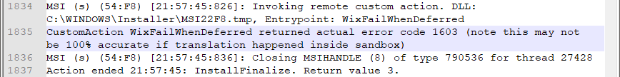
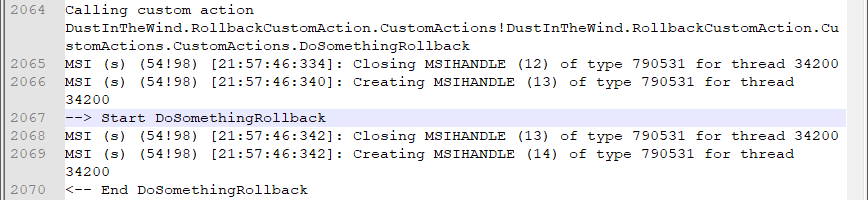

# Rollback Custom Action

## Description

Sometimes, when we install a product, the environment does not meet all the necessary criteria and some step from the installation process may crush. What happens with the changes made by the previous steps that already completed successfully? How can the installer undo those changes?

For each custom action that does a change in the system we must provide an additional custom action that reverts that change. We call this a rollback custom action.

## Implementation

### Step 0 - Create the installer project

Create a simple installer project that deploys a single dummy file. Let's call the project `RollbackCustomAction`.

For more details regarding on how to do this, please see the tutorial:

- [My First Installer](https://github.com/WiX-Toolset-Pills-15mg/My-First-Installer)

This will be the base ground where we'll demonstrate the rollback functionality.

### Step 1 - C# Implementation

Implement the deferred custom action and its corresponding rollback custom action in C#:

```csharp
[CustomAction]
public static ActionResult DoSomething(Session session)
{
    // do some changes here.

    return ActionResult.Success;
}

[CustomAction]
public static ActionResult DoSomethingRollback(Session session)
{
    // revert the changes here.

    return ActionResult.Success;
}
```

The two implementations may seam to be just two regular custom actions at this level but we must take care of a few aspects:

- **Main custom action is deferred** -  The main custom action (`DoSomething` in our example) must be, included in the installer as deferred. The rollback mechanism does not work with immediate custom actions.
  - See the [Deferred Custom Action with Params](https://github.com/WiX-Toolset-Pills-15mg/Deferred-Custom-Action-with-Params) tutorial to learn about deferred custom actions.

- **Rollback custom action implements the opposite action** - The implementation of the rollback custom action (`DoSomethingRollback` in our example) must revert the changes done by the main custom action.

### Step 2 - WiX Declaration

Now let's create the two custom actions in WiX:

```xml
<CustomAction
    Id="DoSomething"
    BinaryKey="CustomActionsBinary"
    DllEntry="DoSomething"
    Execute="deferred" />

<CustomAction
    Id="DoSomethingRollback"
    BinaryKey="CustomActionsBinary"
    DllEntry="DoSomethingRollback"
    Execute="rollback" />
```

At this level, we need to take care of two things:

- The main custom action must have `Execute="deferred"` attribute.
  - As we said previously, the rollback mechanism does not work with immediate custom actions.
- The rollback custom action must have `Execute="rollback"` attribute.

### Step 3 - Installation sequence

Now we need to include the two custom actions into the installation sequence:

```xml
<InstallExecuteSequence>
    <Custom Action="DoSomethingRollback" Before="DoSomething">NOT Installed</Custom>
    <Custom Action="DoSomething" After="InstallFiles">NOT Installed</Custom>
    ...
</InstallExecuteSequence>
```

The important aspects here are:

- **Rollback before main** - The rollback must be sequenced before the main custom action (see the `Before="DoSomething"` attribute).
  - Each rollback custom action, as it is encountered in the execution sequence, is added into a list of actions without being executed. In case of an error, the entire list of rollback actions is executed.
  - By adding the rollback custom action before the main one we ensure that it will be executed ether if the main custom action crushes or any subsequent one crushes.
  
- **Same execution condition** -  Both rollback and its main custom action must have the same execution condition.

- **Main before `InstallFinalize`** - The main custom action must be sequenced somewhere between `InstallInitialize` and `InstallFinalize`.
- We choose to place it after `InstallFiles` which is between the two mentioned custom actions.

Another important note:

- Because a deferred custom action is used when we intend to perform updates to the system, it must be sequenced only in the `InstallExecuteSequence` and not in the `InstallUISequence`.

### Step 4 - Add the trigger mechanism for failing


### Step 5 - Install with error and rollback

After build, the installer can be run like this in order to provoke an error and trigger the rollback process:

```
msiexec /i RollbackCustomAction.msi /l*vx install-with-error.log WIXFAILWHENDEFERRED=1
```

In the `install-with-error.log` file we will find the error message thrown by the `Crush` custom action:



And, later in the log, we find that the rollback custom action was run:



### Step 6 - Install with success

To run the installer without raising an error, success skip the `WIXFAILWHENDEFERRED` parameter:

```
msiexec /i RollbackCustomAction.msi /l*vx install-with-success.log
```

The log file `install-with-success.log` will contain no message regarding the rollback custom action.

